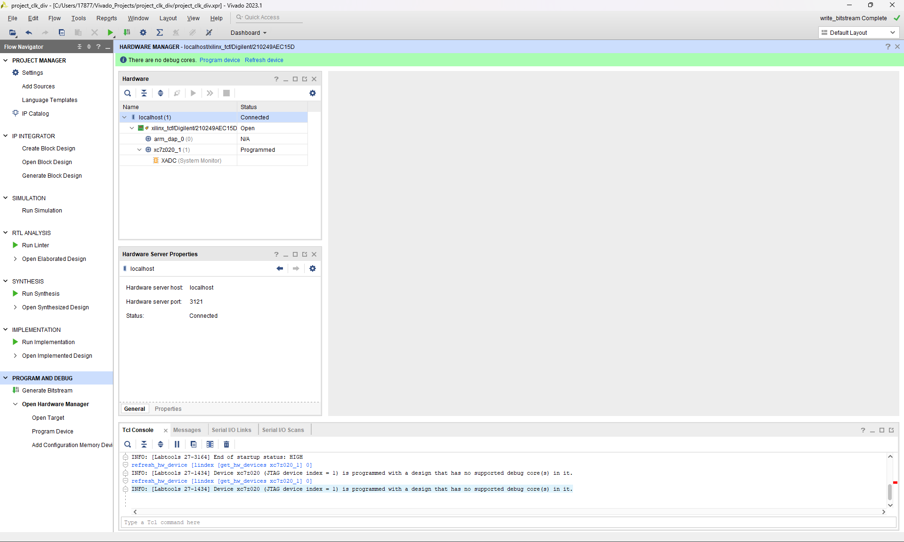
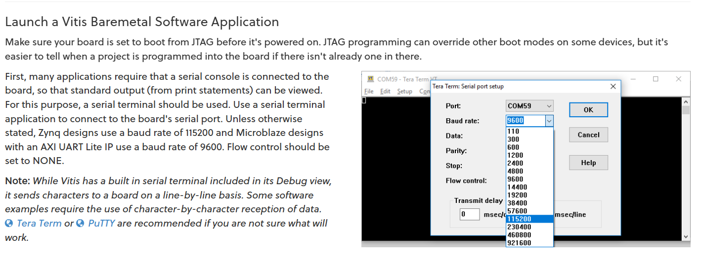
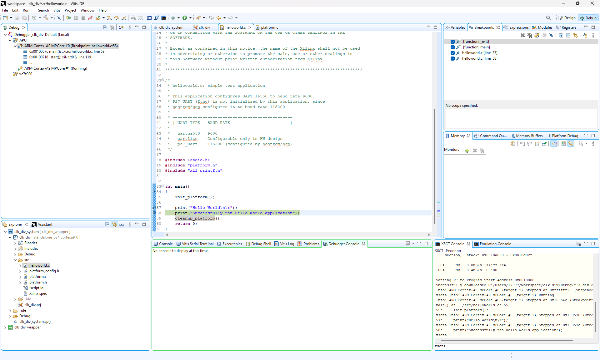

# 6/24
Goal: Successfully run software from Vitis & check logic analyzer

Followed tutorial [Getting Started with Vivado and Vitis for Baremetal Software Projects](https://digilent.com/reference/programmable-logic/guides/getting-started-with-ipi)

Result: Two Issues that may prevent software to run from Vitis (naturally logic analyzer signals are jammed): 
- Different from tutorial when it requires me to set my board to boot from JTAG:
  - Other than using the emulator shown, I used **hardware manager**->**program device**
    - Got this output: "INFO: [Labtools 27-1434] Device xc7z020 (JTAG device index = 1) is programmed with a design that has no supported debug core(s) in it." 
    - Does it mean board is connected via JTAG with JTAG #1?
    - hardware manager:
    - COM59:
- Not showing print message
  - If I chose core0, I should see print message in Core #0 console. But I'm getting no print message: 

Before next day: Post issue in forums and do general research