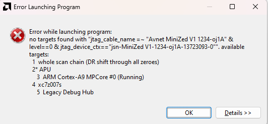
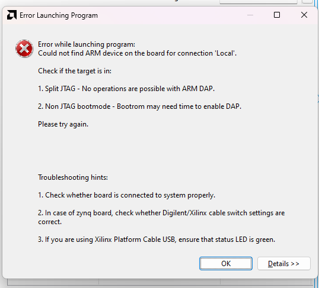

# 6/25

Goal: Successfully run software from Vitis & check logic analyzer

Reference:

- [Debugging Standalone Applications with the Vitis Debugger](https://xilinx.github.io/Embedded-Design-Tutorials/docs/2021.2/build/html/docs/Introduction/ZynqMPSoC-EDT/5-debugging-with-vitis-debugger.html)
- [Vitis IDE V2023.1 Not Printing](https://support.xilinx.com/s/question/0D54U00008VPpkRSAT/vitis-ide-v20231-not-printing)
- [Use Vivado to build an Embedded System](https://xilinx.github.io/xup_embedded_system_design_flow/lab1.html)

Result of Minized & Microzed

- Vivado:
  - Minized: detects waves, but system clock has wrong frequency
  - Microzed: doesn't detect waves

- Vitis (Both boards switched to JTAG boot mode in response to the errors, but errors still exists):
   - Minized:
      
      
   - Microzed:

      