# Test Notes

Figuring out the time scale for Waveforms:

- How does rate and base relate to the accuracy of frequency
  - What is rate, base, and div?
    - Base: The time base (seconds/division) setting from the channel configuration toolbar lets you select the rate at which the waveform is drawn across the screen. This setting is a scale factor. For example, if the setting is 1 ms, each horizontal division represents 1 ms and the total screen width represents 10 ms (ten divisions). Changing the sec/div setting allows you to visualize longer or shorter time intervals of the input signal.
    - Rate: adjusts the sample rate for digital channels.
    - Samples: adjust the number of samples to acquire for digital channels.
  - What is Ki and Mi?
    - Ki (kibi-): Stands for 210 or 1024 units.
    - Mi (mebi-): Stands for 220  or 1,048,576 units.
    - Logic Analyzer setting: 16 x 16Ki means that there are 16 channels, each channel can record 16Ki samples
      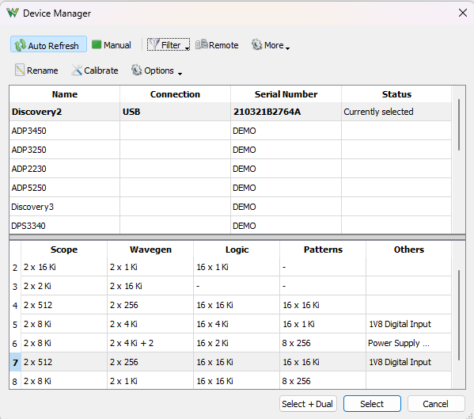 
  - Experiments: (sys_clk rate = 1MHz, pps_clk rate = 500KHz)
    - rate = 1KHz, base = 400ms/div
      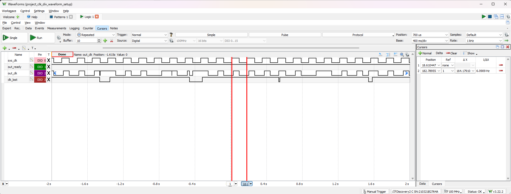
    - rate = 500KHz, base = 800us/div (intriguing because sample rate is half of the frequnecy of sys_clk)
      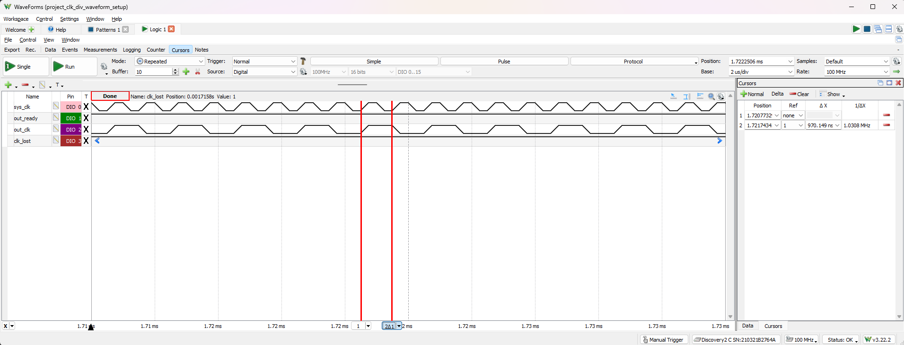 
    - rate = 1MHz, base = 400us/div (intriguing because sample rate is of the same frequnecy of sys_clk)
      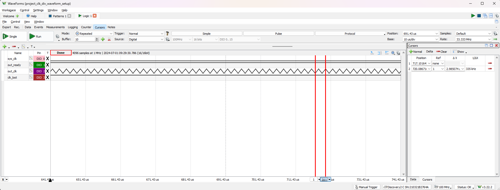
    - rate = 2MHz, base = 200us/div
      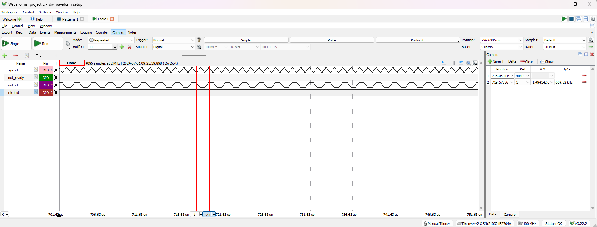
    - rate = 6.25MHz, base = 64us/div
      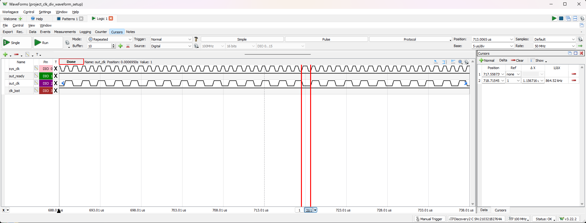
    - rate = 25MHz, base = 16us/div
      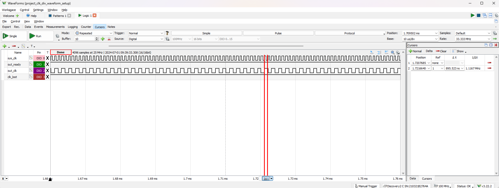 
    - rate = 50MHz, base = 8us/div
      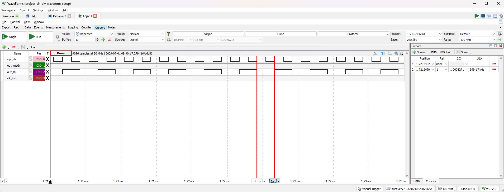 
    - rate = 100MHz, base = 4us/div
      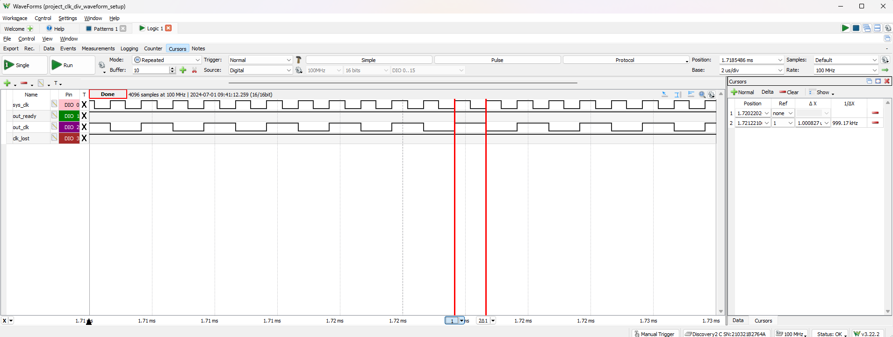 
- Observe a long time window with sys_clk rate = 1MHz, pps_clk rate = 500KHz, and rstn rate = 1Hz
   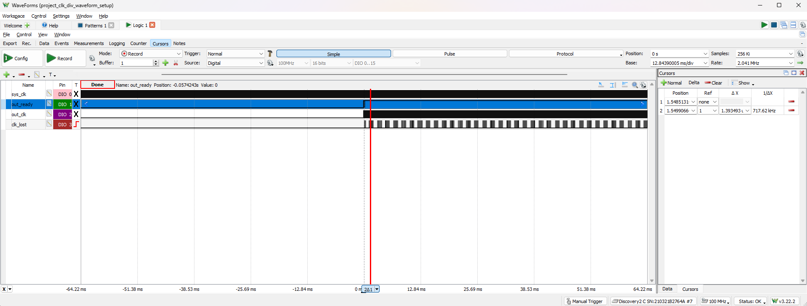
   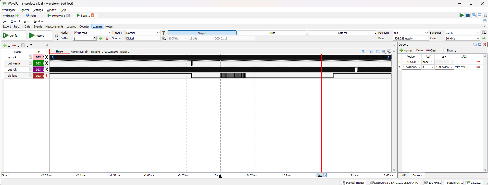
   - Shouldn't have lost
     - can't trust pattern
      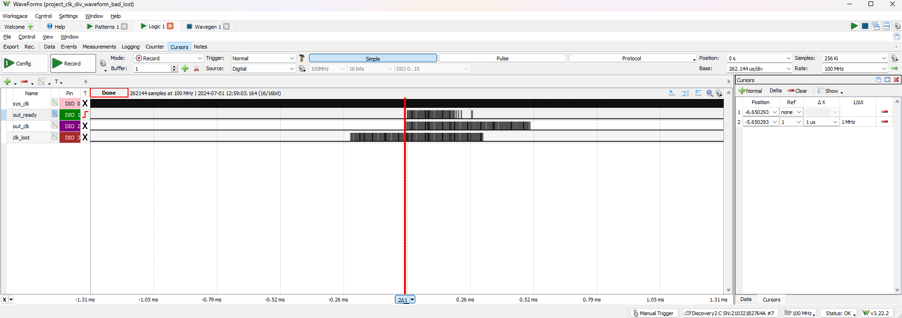 
     - add monitor signal for pps
      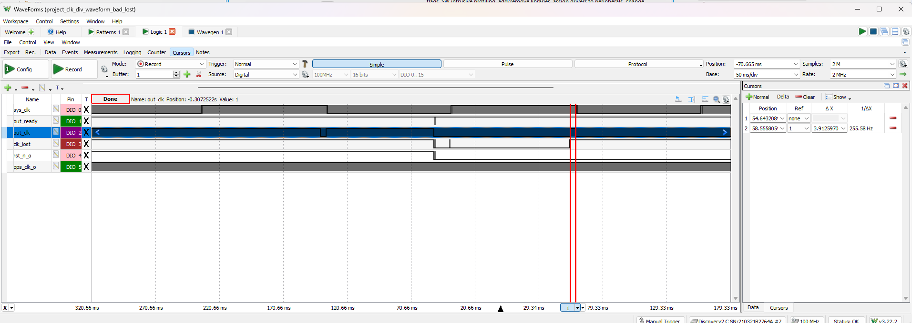 
      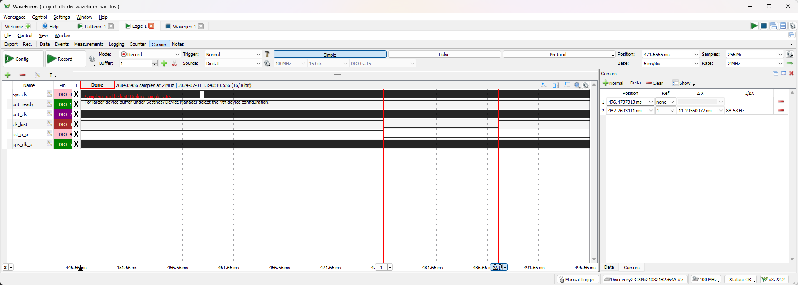
      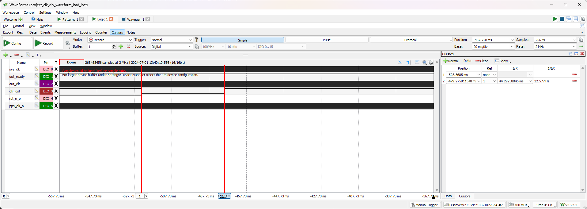
      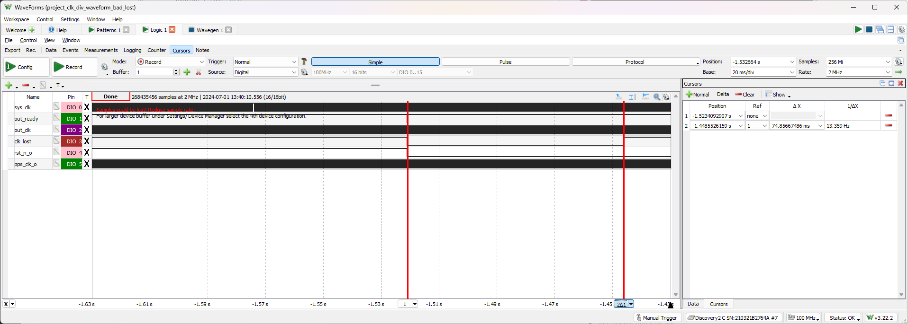
  - added signals for counters
    - counters have little peaks which has the same frequency as sys clock?
  - Detect voltage levels (USE SCOPE FIRST)
    - very weird voltage level for sys_cnt0_bit and sys_cnt1_bit
      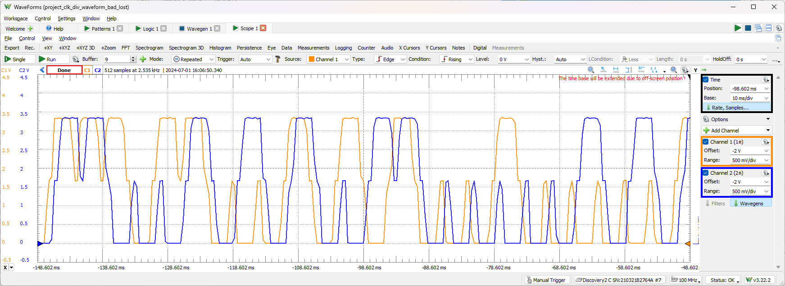 
      It turns out to be aliasing
    - weird for clk_lost as well
    - 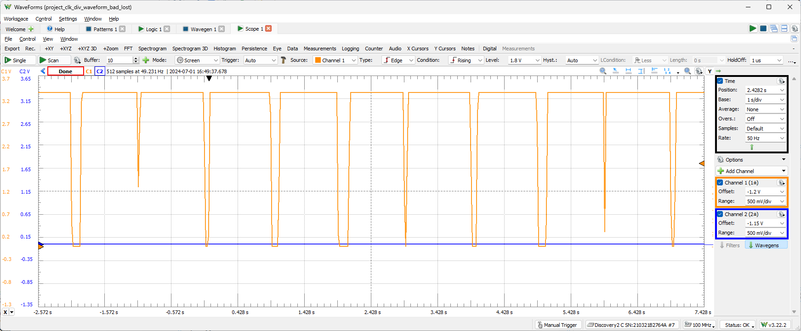
- PPS with different frequencies
- Generate custom clocks with segments