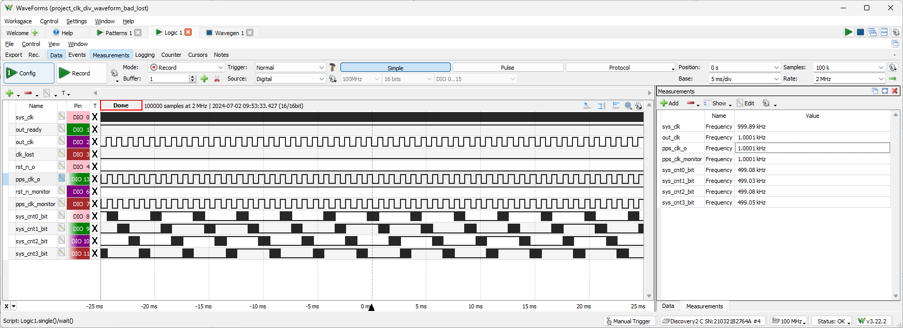
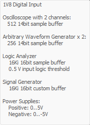
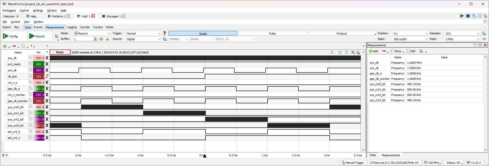
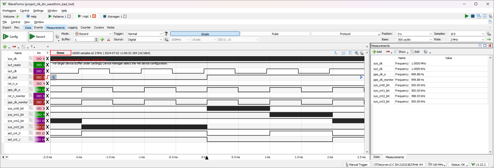
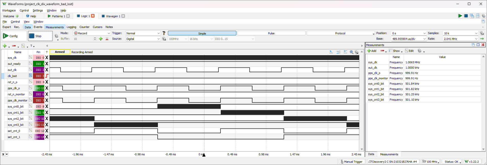
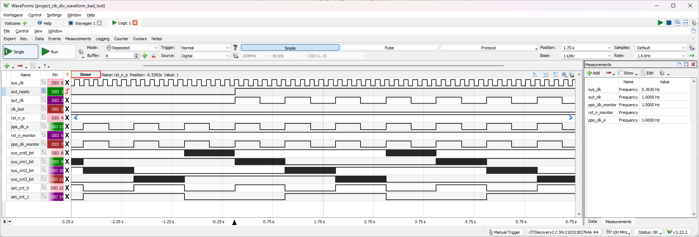
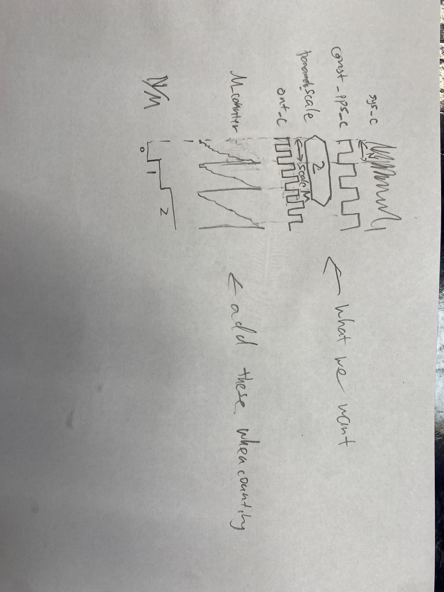

# Removed weird glitches

- Important hint on screen:
   > Samples could be lost! Reduce sample rate.
   >
   >  For larger device buffer under Settings/Device Manager select the 4th device configuration.
- Used the 4th configuration, made sampling rate 2MHz (at least twice as fast as sys_clk), used **Measurements** window for easier observation.
- Got waveform will no weird peaks, peaks are possibly due to the incorrect voltage level in my previous measurements which used the 7th configuration. 

   
- The waveform still has clk_lost being high when it shouldn't.

## Problem

- Didn't switch counter when it should've, and clock lost at very weird places

# Removed unexpected lost signal

- added [edge_detector](../clock_divider/src/hw/edge_detector.vhd) and made adjustments in [clk_div_top](../clock_divider/src/hw/clk_div_top.vhd), no unexpected clk_lost rising edges are observed
- testbench is not yet updated

# Misunderstanding
- Previous Understanding: I have an infinitely fast sys_clk and a slow pps_clk that can be any frequency. I have to output a out_clk that is of the same frequency of the pps_clk.
- Correction:
  - pps_clk rate is always 1Hz
  - I'm not only outputing pps_clk, I will have a scale parameter **M** that makes the output clock **M** times faster than the pps_clk, or **M** Hz.
  - Suppose the number of sys_clk tiks per pps_clk pulse (1s) is **Nx**, we sum up N over 4 pps_clk periods and average it to get an accurate **Navg** = **N1** + **N2** + **N3** + **N4**. Hence we'll output an out_clk rising edge every **M/N** sys_clk rising edge.
- Ideas for correction
  - The current alogorithm gives me N already, and I can output in the same frequency as pps_clk
    
  - I achieve it by having a **count**. **count** is incremented every sys_clk R. When **count** < **N**, out_clk is high, otherwise, out_clk is low.
  - To make out_clk **M** times faster than the pps_clk, I have to make it so that When **count** < **N/M**, out_clk is high, otherwise, out_clk is low. But division is heavy on hardware complexity and time, and I can't simply shift because M could be non-power-of-two.
  - My idea is to adjust the scale when I'm counting N by adding a M_counter. I initialize N = 0, I initialize M_counter = 0. I increment M_counter for every sys_clk R until M_counter equals M, and by then I increment N by 1 and clear M_counter. So then I would instead count N/M directly.
   