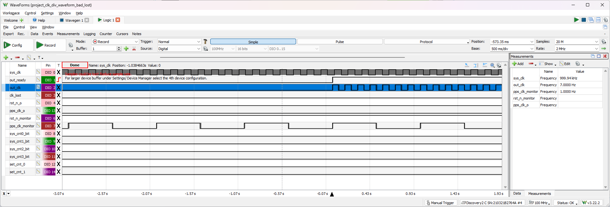
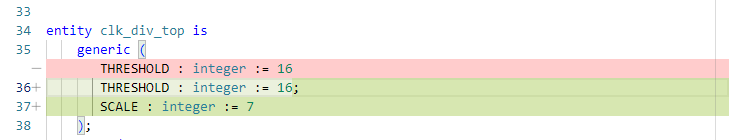
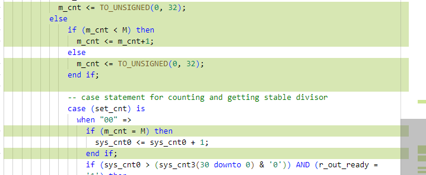
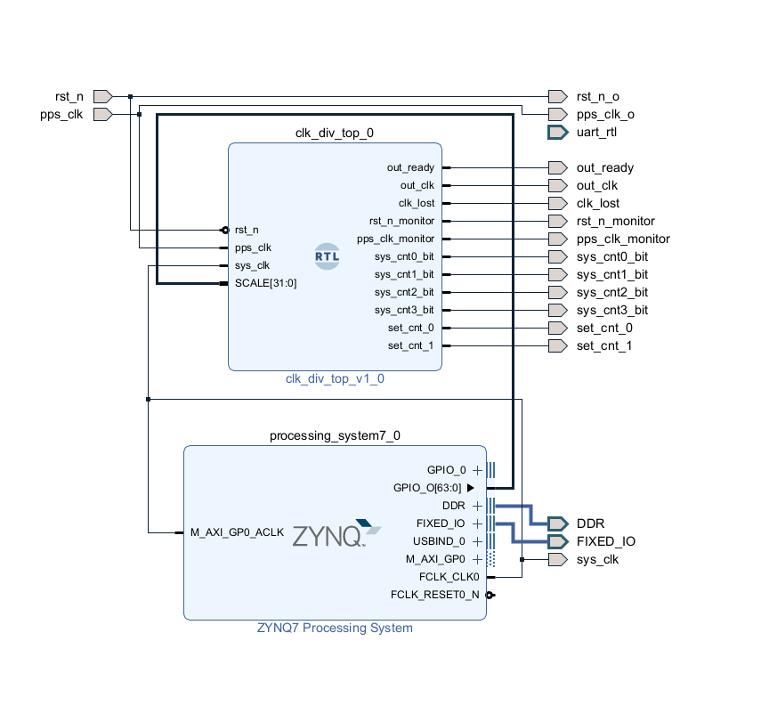

# Made scaling work with hardcoded parameters

- added a parameter as scaling from pps
   
- added M to adjust for 0-indexing and m_cnt to update sys_cntx less frequently
   
- only updaye sys_cntx when m_cnt is filled
  

# Ma scaling work with uart communication
- Reference:
  - HWUserGuide: 2.3.2 USB-to-UART Bridge
  - Forum: [How to configure UART for PL part of Zynq-7000 FPGA??](https://support.xilinx.com/s/question/0D52E00006hpe9iSAA/how-to-configure-uart-for-pl-part-of-zynq7000-fpga?language=en_US)
  - YouTube - [Zynq AXI UARTLITE Implementation | Zedboard](https://youtu.be/VLcS4HPiuCs)
- Bitstream generated, not yet finished with C code and testing
   