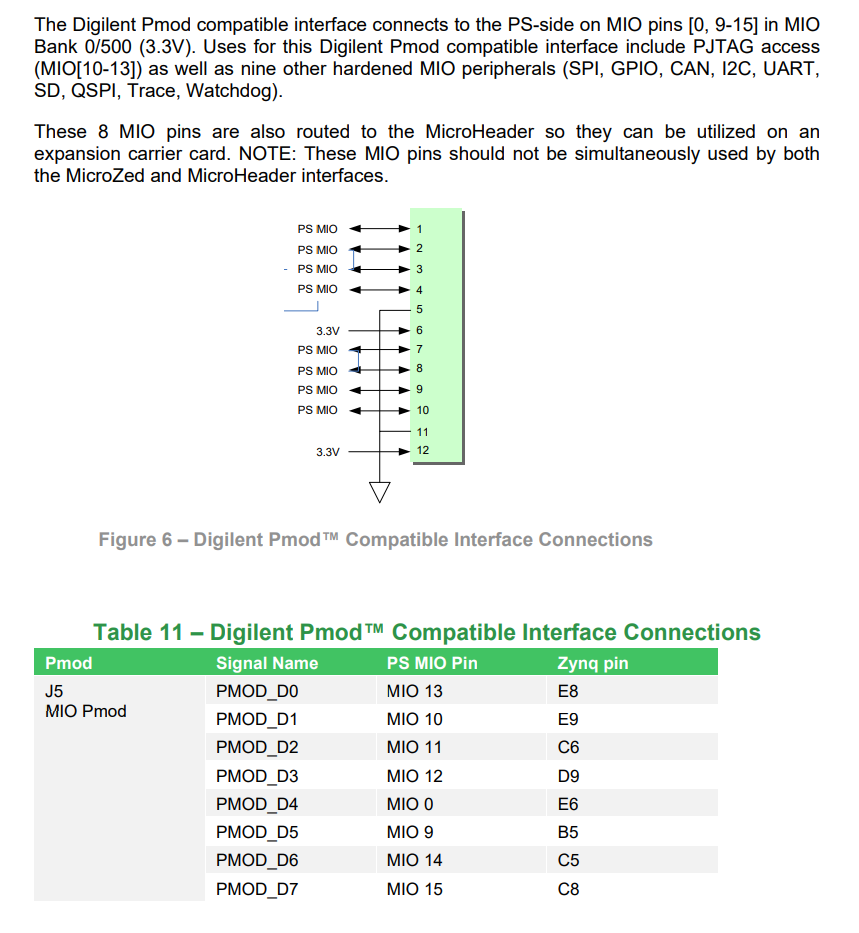
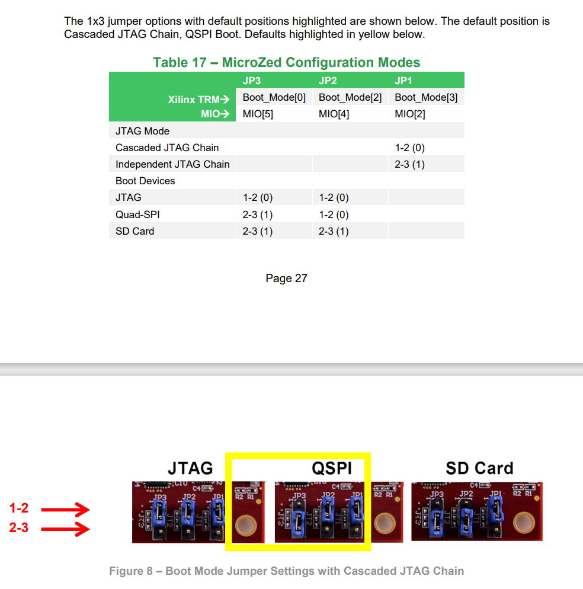
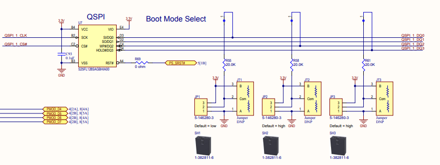

#MicroHeaders

## MIO Pins

## PS & PL I/O
In the context of Zynq System on a Chip (SoC) platforms, which combine both traditional processor (PS, or Processing System) and FPGA (PL, or Programmable Logic) components, the terms PL I/O and PS I/O refer to the Input/Output capabilities of these two distinct parts of the chip. Here's a breakdown of what each term means:

1. **PS I/O (Processing System I/O)**:
   - These are the I/O peripherals connected directly to the ARM-based processing system in the Zynq SoC. 
   - The PS includes typical processor peripherals such as USB, Ethernet, UART, SPI, I2C, SD card interfaces, and general-purpose I/O (GPIO). 
   - These I/O interfaces are managed by the software running on the ARM cores, typically an operating system like Linux or a real-time OS, and are used for interfacing with standard peripherals and external devices.

2. **PL I/O (Programmable Logic I/O)**:
   - PL I/O refers to the I/O capabilities provided by the FPGA part of the Zynq SoC.
   - These I/O are highly customizable and are used to implement specific interfaces that might not be natively supported by the PS. This could include custom digital communication protocols, interfacing with custom sensors or devices, or high-speed data interfaces.
   - The nature of PL I/O allows for high flexibility in terms of timing, protocol adaptation, and parallel processing, making it suitable for hardware acceleration tasks and specialized digital signal processing.

In Zynq systems, the distinction between PL and PS also extends to how these components interact. Typically, there are interfaces designed to allow the PS to control and communicate with the PL, facilitating data transfer and coordination between the processor and the FPGA. This integration allows developers to leverage the strengths of both traditional processing and programmable logic in a single device.

## I/O Banks
Within a PL I/O bank, there are 50 I/O capable of up to 24 differential pairs. Differential LVDS 
pairs on a -1 speed grade device are capable of 950Mbps of DDR data. Each differential pair 
is isolated by a power or ground pin. Additionally, eight of these I/O can be connected as 
clock inputs (four MRCC and four SRCC inputs). Each PL bank can also be configured to be 
a memory interface with up to four dedicated DQS data strobes and data byte groups. Bank 
35 adds the capability to use the I/O to interface up to 16 differential analog inputs. One of 
the differential pairs (JX1_LVDS_2) in Bank 34 is shared with PUDC_B.

> UG475 is telling you that in a typical bank there are "two pins" that are not part of a differential-pair (ie. these two pins can only be used for single-end IO).  One of the "two pins" is located near the top-side of the IO bank and one is located near the bottom-side of the IO bank.  All other IO pins in the bank are arranged as differential-pairs.  You can use the differential-pair pins for differential IO -or- you can use the differential-pair pins as two single-end IO.
> 
> For example, from Figs 3-85 and 3-86 of UG475(v1.18), we see that pins T3 and U7 are the "two pins" in bank-34 that can only be used for single-end IO.  All other IO pins in bank-34 are arranged as differential-pairs.
>
> Finally, note that Fig 3-85 and Fig 3-86 are package views of the FPGA, which do not show top-side and bottom-side of a bank.  To see top-side and bottom-side of an FPGA bank, you need to use a device-view of the FPGA which is shown inside Vivado.
>
> Each pin of a differential pin pair can be used as a single-end pin. This can be specified by using a single-end IOSTANDARD (eg. LVCMOS33) constraint in the xdc file for your Vivado project.

## Configuration Modes
The boot mode pins are shared with MIO[8:2]. The usage of these mode pins can be and are 
used as follows:
- MIO[2] / Boot_Mode[3]
- sets the JTAG mode
- MIO[5:3] / Boot_Mode[2:0]
- select the boot mode
- Boot_Mode[1] is fixed since it is only required for NOR boot, which is not supported on 
MicroZed
- MIO[6] / Boot_Mode[4] 
- enables the internal PLL
- fixed to ‘enabled’ on MicroZed
- MIO[8:7] / Vmode[1:0]
- configures the I/O bank voltages
- fixed on MicroZed
- MIO Bank 0 / 500 (MIO[7] / Vmode[0]) set to ‘0’ for 3.3V
-  MIO Bank 1 / 501 (MIO[8] / Vmode[1]) set to ‘1’ for 1.8V

All mode pins have resistor footprints such that any could be pulled either high or low through a 20 KΩ resistor if a designer chooses to experiment. By default, four mode signals are not jumper-adjustable and are populated as follows:
-  MIO[3] / Boot_Mode[1] is pulled low via 20 KΩ resistor. 
-  MIO[6] / Boot_Mode[4] is pulled low via 20 KΩ resistor. 
-  MIO[7] / Vmode[0] is pulled low via 20 KΩ resistor. 
-  MIO[8] / Vmode[1] is pulled high via 20 KΩ resistor. 
  

