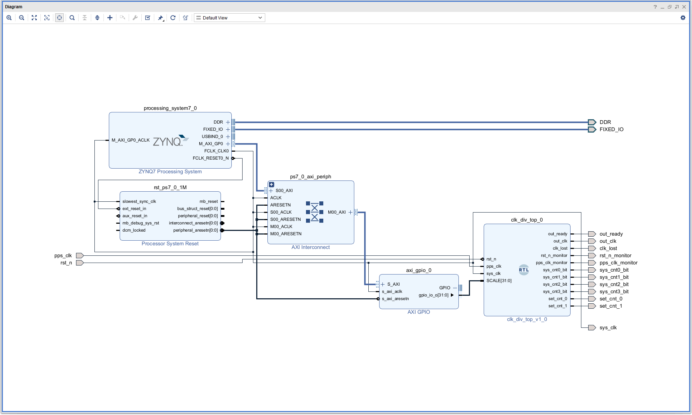
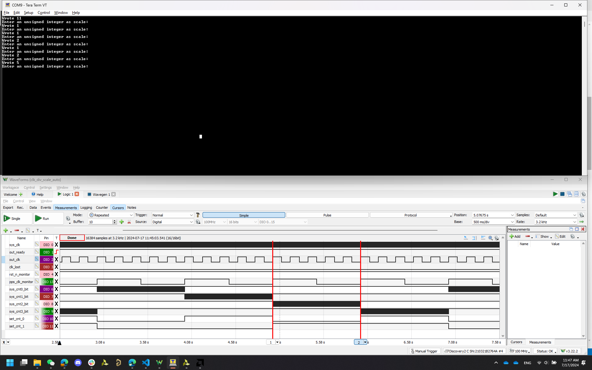

# Guides & Docs:
- [Forums](https://support.xilinx.com/s/topiccatalog?language=en_US&t=1719428356954)

- [Guides for Xilinx Tools](https://digilent.com/reference/programmable-logic/guides/start)
  - [Installing Vivado, Vitis, and Digilent Board Files](https://digilent.com/reference/programmable-logic/guides/installing-vivado-and-vitis)
  - [Getting Started with Vivado and Vitis for Baremetal Software Projects](https://digilent.com/reference/programmable-logic/guides/getting-started-with-ipi)
  - [Getting Started with Vivado for Hardware-Only Designs](https://digilent.com/reference/programmable-logic/guides/getting-started-with-vivado)
  - [Using a Peripheral with a Hierarchical Block in Vivado IPI and Vitis](https://digilent.com/reference/programmable-logic/guides/hierarchical-blocks)
  - [Getting Started with Zynq Servers](https://digilent.com/reference/programmable-logic/guides/zynq-servers)
  - [Using Digilent Pmod IPs in Vivado and Vitis (Under Construction)](https://digilent.com/reference/programmable-logic/guides/getting-started-with-pmod-ips)

- [Vitis Tutorials V2023.1](https://github.com/Xilinx/Vitis-Tutorials/tree/2023.1)
  - [Versal Platform Creation Quick Start V2023.1](https://github.com/Xilinx/Vitis-Tutorials/tree/2023.1/Getting_Started/Vitis_Platform)

- [Microzed](https://www.avnet.com/wps/portal/us/products/avnet-boards/avnet-board-families/microzed/microzed-board-family/) and [AES-MBCC-BRK-G Carrier Board](https://www.avnet.com/shop/us/products/avnet-engineering-services/aes-mbcc-brk-g-3074457345635221620/)
  - [Microzed Hardware User Guide V1.7](https://www.avnet.com/wps/wcm/connect/onesite/58eaef36-f0b2-4dd4-8440-540bdc2acd3d/5276-MicroZed-HW-UG-v1-7-V1.pdf?MOD=AJPERES&CACHEID=ROOTWORKSPACE.Z18_NA5A1I41L0ICD0ABNDMDDG0000-58eaef36-f0b2-4dd4-8440-540bdc2acd3d-nDjezWU)
  - [Microzed RevB Schematic](https://www.avnet.com/wps/wcm/connect/onesite/a597668b-80fc-4d8f-b46b-78a2949179fa/MicroZed_RevB_Schematic_130617_0.pdf?MOD=AJPERES&CACHEID=ROOTWORKSPACE.Z18_NA5A1I41L0ICD0ABNDMDDG0000-a597668b-80fc-4d8f-b46b-78a2949179fa-nDjikUA)
  - [MicroZed Getting Started User Guide](https://www.avnet.com/opasdata/d120001/medias/docus/4/Avnet-MicroZed-Getting-Started-EN-User-Guide.pdf)
  - [UG-AES-MBCC-BRK-G Hardware User Guide V1.2](https://www.avnet.com/opasdata/d120001/medias/docus/178/UG-AES-MBCC-BRK-G-V1_2.pdf)
  - [MBCC-BKO RevA Schematic](https://www.avnet.com/opasdata/d120001/medias/docus/58/AES-MBCC-BRK-G_RevA_Schematic_131114.pdf)

- UART
  - [HOW TO INSTALL CP210X VIRTUAL COM PORT DRIVERS / YAESU RADIOS](https://youtu.be/vuYs4A_kcsg?feature=shared)
  - [Tera Term application](https://github.com/TeraTermProject/teraterm/releases/tag/v5.2)
  - [Setting correct baud rate](https://support.xilinx.com/s/feed/0D54U00008VPpkRSAT?language=en_US)
  
- Embedded Design Tutorial
  - [Design Example 1: Using GPIOs, Timers, and Interrupts](https://xilinx.github.io/Embedded-Design-Tutorials/docs/2021.1/build/html/docs/Introduction/ZynqMPSoC-EDT/7-design1-using-gpio-timer-interrupts.html)
  - [Using the GP Port in Zynq Devices](https://xilinx.github.io/Embedded-Design-Tutorials/docs/2021.1/build/html/docs/Introduction/Zynq7000-EDT/5-using-gp-port-zynq.html)
  - [Vitis Unified Getting Started and Featured Tutorials](https://support.xilinx.com/s/question/0D54U0000889tzVSAQ/vitis-unified-getting-started-and-featured-tutorials)
  - [Vitis Unified Software Platform Documentation: Embedded Software Development (UG1400)](https://docs.amd.com/r/2023.1-English/ug1400-vitis-embedded/Getting-Started-with-Vitis)
- [Waveforms](https://digilent.com/reference/software/waveforms/waveforms-3/reference-manual)
  - [time group](https://digilent.com/reference/software/waveforms/waveforms-3/reference-manual#time_group)

# Complete Projects
The setup using AXI is working:
- [project_clk_div_scale_auto (Vivado)](https://drive.google.com/drive/folders/1vkaxamBbWyCxDWIcu4RDNkx8ieC-f-M_?usp=drive_link)
- [clk_div_scale_auto (Vitis)](https://drive.google.com/drive/folders/1Xe1Gqwh48aInEfbvtmlU4EJX8Dp-QmZc?usp=drive_link)
- [clk_div_scale_auto (WaveForms)]()

The setup using PS is still problematic.
# Code
- 
- [module](./src_scale_auto_axi/clk_div_top.vhd)
- [testbench](./src_scale_auto_axi/clk_div_top_tb.vhd)
- [constraint](./src_scale_auto_axi/clk_div.xdc)
- [software](./src_scale_auto_axi/helloworld.c)

# Software setup
- I/O standard for pins: Vcco_34 = 3.3 V

- Pin Mapping (Bank 34):

  | package_pin | pin_name | JX1_pin_# | CON1_pin_# | block_pin_name | DIO_# |
  | - | - | - | - | - | - |
  | N/A | GND | N/A | 1, 2 | N/A | GND, GND |
  | T11 | JX1_LVDS_0_P | 11 | 5 | sys_clk | 0 |
  | T12 | JX1_LVDS_1_P | 12 | 6 | out_ready | 1 |
  | T10 | JX1_LVDS_0_N | 13 | 7 | out_clk | 2 |
  | U12 | JX1_LVDS_1_N | 14 | 8 | clk_lost | 3 |
  | U13 | JX1_LVDS_2_P | 17 | 9 | rst_n | W1 |
  | V12 | JX1_LVDS_3_P | 18 | 10 | pps_clk | W2 |
  | V13 | JX1_LVDS_2_N | 19 | 11 | rst_n_monitor | 4 |
  | W13 | JX1_LVDS_3_N | 20 | 12 | pps_clk_monitor | 13 |
  | T14 | JX1_LVDS_4_P | 23 | 13 | sys_cnt0_bit | 6 |
  | P14 | JX1_LVDS_5_P | 24 | 14 | sys_cnt1_bit | 7 |
  | T15 | JX1_LVDS_4_N | 25 | 15 | sys_cnt2_bit | 8 |
  | R14 | JX1_LVDS_5_N | 26 | 16 | sys_cnt3_bit | 9 |
  | Y16 | JX1_LVDS_6_P | 29 | 19 | set_cnt_0 | 10 |
  | W14 | JX1_LVDS_7_P | 30 | 20 | set_cnt_1 | 11 |

- To program via JTAG with Independent JTAG chain: JP3: 1-2 (0), JP2: 1-2 (0), JP1: 2-3 (1)
  - 
  - far view: 
  - near view: 

# Running Waveform

# Problem
- If I change the scale after out_clk is ready, out_clk will be out of sync from pps_clk. I'll change RTL so that reset can be triggered whenever scale is changed.
- Issue with the PS setup: The takeway from [fpgawork video](https://modsio.slack.com/archives/D06H8EWELQM/p1721239598732549) is mainly that EMIO starts from BANK2. But when I use BANK2, only the LSB is recognized. **The main problem is still that I can't find the exact documentation of EMIO pin mapping.**